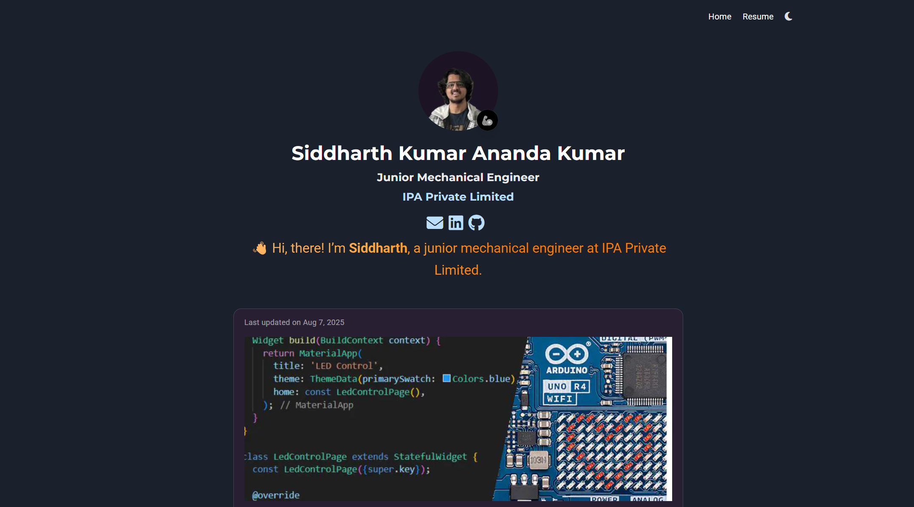

# Siddharth Kumar Ananda Kumar’s Portfolio

Welcome to the source code for my personal portfolio website! Built using Hugo and the HugoBlox/Wowchemy portfolio theme, this site showcases my projects, background, and creative spirit.

---

## Live Preview

Here’s a snapshot of the portfolio as it appears now:


---

## Built With

-**[Hugo](https://gohugo.io/)** – A fast, static site generator

-**[Hugo Portfolio Theme](https://github.com/wowchemy/starter-hugo-portfolio-theme)** – A flexible, widget-based portfolio theme

-**SCSS** – Fully utilized for styling

-**[Netlify](https://app.netlify.com)** – Excellent for forms

---

## Getting Started

### Prerequisites

-Go (for Hugo) installed on your system

-Optional: Git, if you’re cloning this repo

### Setup Steps

-Clone the repo:
```
git clone https://github.com/Steelbot2803/portfolio.git
cd portfolio
```

-Install Hugo (if not installed):
```
# macOS (Homebrew)
brew install hugo

# Ubuntu/Debian
sudo apt update && sudo apt install hugo

# Windows (Chocolatey)
choco install hugo-extended
```

-Serve the site locally:
```
hugo serve
```

-Visit http://localhost:1313 to see your live preview.

### Customization Tips

You can quickly tailor your site via:

-***Theme configs***: Modify files under config/_default/ to change themes, layouts, or site metadata.

-***Content***: Add your own pages or posts under the content/ folder.

-***Assets***: Drop images, videos, or other media into the static/ or assets/ directories.

### Deployment

-***Netlify***: Just connect this GitHub repo to Netlify, and watch it auto-deploy on every push.

-Alternate hosters (e.g., Vercel, GitHub Pages) work perfectly fine too!

---

## About Me

I'm Sid, a junior mechanical engineer from Bengaluru with a passion for design, tech, robotics, and AI. This site is my creative playground—coded with care to reflect my journey and interests.

---

## Contributing

This is mostly a personal site, but if you’ve got ideas on theme enhancements or styling tweaks, I’d love to hear them—PRs are welcome!

---

## License

MIT License

---

## Acknowledgments

-Hugo – because static sites rock

-Hugo Portfolio Theme – for making my life easier with no-code widgets and dark/light themes

-Preview courtesy of preview.png in the repo

---

Enjoy tinkering with it—and if you ever want help customizing or bulking it up with interactive widgets or project cards, I’ve got your back.

—Sid (aka Steelbot2803)

